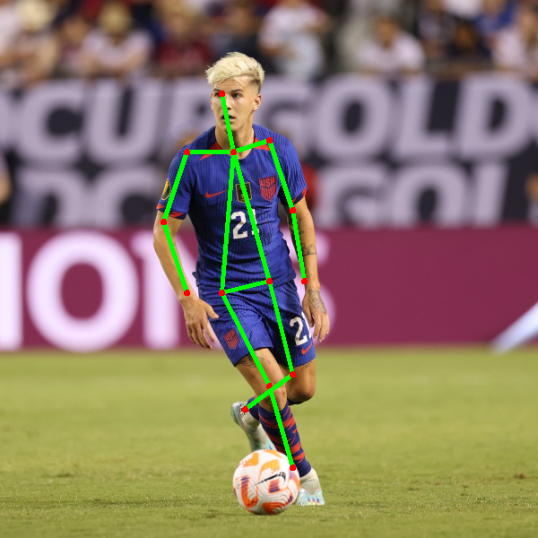
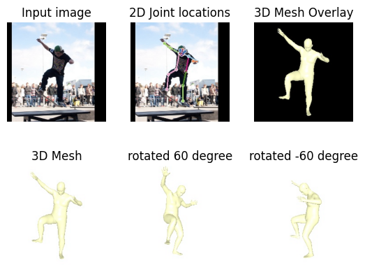
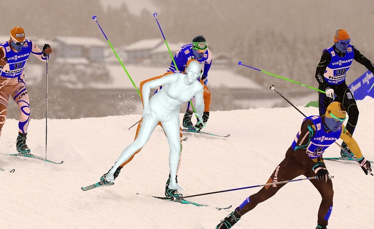

# 2D Pose Estimation and Mesh Recovery

Colab notebook of some state-of-the-art methodologies (Openpose, HMR2, I2L_Meshnet) used for 2D human pose estimation and human mesh recovery.
 
 

## Demo output
#### Open Pose

 
 

#### HMR2

 
 

#### I2L_Meshnet Pose
